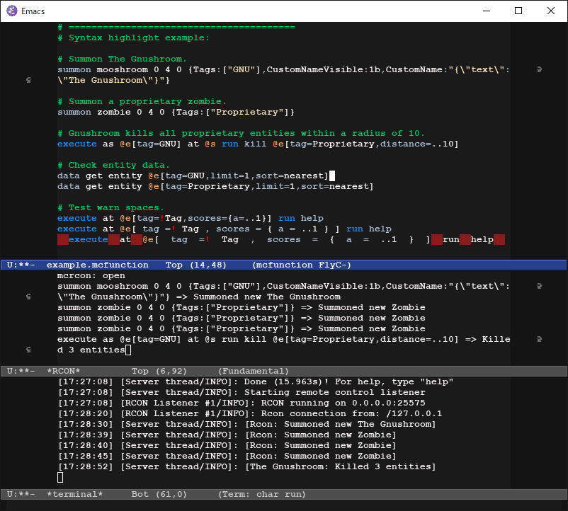

# mcf-mode - Emacs major mode for editing Minecraft mcfunction

## The main features of mcf
* Syntax highlighting Minecraft mcfunction.
* Communicate with Minecraft RCON server.

**As it is currently under development, there can be significant changes.**
## Installation
Move mcf-mode.el and mcf-mode.el to emacs' load path (e.g. /usr/share/emacs/26.3/lisp/progmodes).  
Use `M-x load-library` to load it and `M-x mcf-mode` to use the mode, or add the line :
~~~elisp
(require 'mcf-mode)
~~~
to .emacs.

## Default key bindings
* `C-c C-c  mcf-execute`
* `C-c C-e  mcf-execute-at-point`
* `C-c C-r  mcf-reload`

---

## Commucate with Minecraft RCON 

RCON is an official network protocol for communicating with Minecraft.
You can send cool commands to Minecraft and receive cool responses.

*Warning: Minecraft RCON is not thread safe before 1.14.3-pre2.*

* `M-x mcf-rcon` to connect to Minecraft RCON server.
* `M-x mcf-rcon-disconnect` to disconnect from Minecraft RCON server.

## Setup RCON server

Edit `server.properties` file located in the Minecraft server directory.
~~~
rcon.port=25575
enable-rcon=true
rcon.password=PASSWORD
~~~

## Settings example

~~~elisp
;; RCON settings.
(setq 
 ;; If you want to write a password to your emacs settings file, just write.
 mcf-rcon-password "PASSWORD"
 ;; Default host address.
 mcf-rcon-address "localhost"
 ;; Default port number.
 mcf-rcon-port 25575
 ;; Describe packet information.
 mcf-rcon-print-packet-information t)
~~~

### Minecraft command macro `mcf-eval`

~~~ elisp
(mcf-eval "help help")

(mcf-eval "list" (payload)
  (string-match "There are \\([0-9]+\\) of a max 20 players online" payload)
  (when (equal (match-string 1 payload) "0")
    (message "Nobody is here :(")
    (mcf-eval "summon creeper 0 10 0 {CustomName:\"{\\\"text\\\":\\\"Player\\\"}\"}")))
~~~

`mcf-eval` does not block processing, and BODY is evaluated when the server responds.

## Changelog
### 0.2.4
* A network process never querying before exit Emacs.
* Highlights valid scoreboard name.
* Display command execution result.
* Added reload command.
### 0.2.3
* Auto connect/Reconnect to RCON server when executes command.
* RCON Command queue feature.
* Fixed: RCON problem with 32-bit Emacs.
### 0.2.2
* Package name is mcf-mode, not mcfunction-mode.
* Package prefixes are changed. mcfunction-* and mcrcon-* to mcf-*
* Specified supported emacs version.
* Fixed: Empty password is not working.
### 0.2.1
* Fixed: `mcfunction-execute-command-at-point' is duplicated.
### 0.2
* Minecraft RCON client (mcrcon.el) supported.
* IPC feature has been deprecated.
* More colorful highlights.
### 0.1
* First commit.

## TODO
* Scanning syntax from the server's help results, It's to use for highlighting and completion.
* datatag <=> sexp conversion.
* More hooks.
